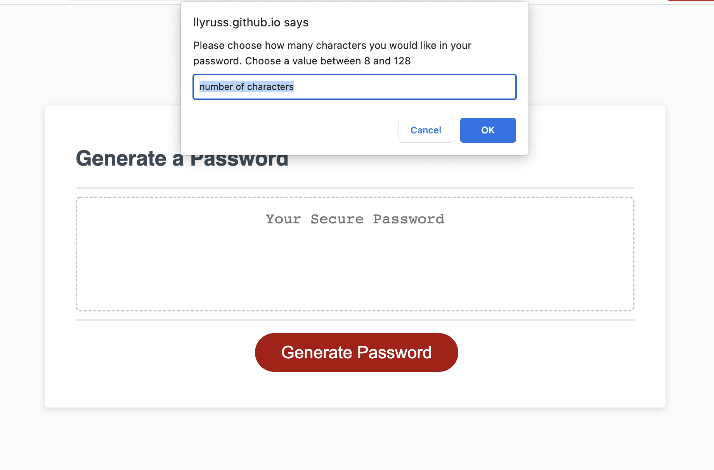

# Random Password Generator

## Description
I created this project to help users generate random passwords. Many people repeadedly use the same password for multiple applications, which is not very secure compared to using individual passwords for everything. Many people also use familiar phrases and numbers in their passwords, which are easy to remember but also less secure. This project helps the user come up with unique passwords without having to rely on their own imagination. I built this project with the hope that it will help users generate and therefore utilizer a random password for each login. 

## Installation

This is a web-based app and requires no installation to use.

## Usage

To find the password generator go to: https://llyruss.github.io/Password-Generator/

To generate a password click on "generate a password" and then answer the five prompted question to se your password's character length and character types.

## Credits

There were no collaborators on this project. 

The shuffling function was borrowed from Geeks for Geeks and can be found here: https://www.geeksforgeeks.org/how-to-shuffle-an-array-using-javascript/

## License

MIT Lisence

---
